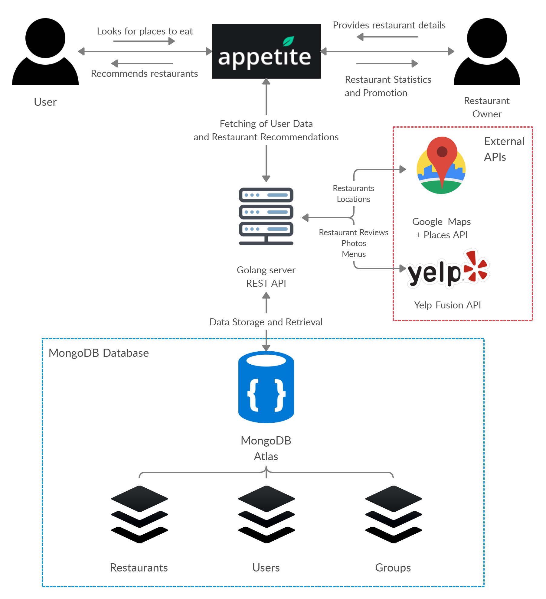

# Appetite

## **Figma Link:**

https://www.figma.com/file/iwdJdqLhZt13azgZaYGsV1/Appetite?node-id=31%3A579

# Product Details

## What are you planning to build?

Appetite is the mobile app for food lovers who want to discover and try new cuisines with friends, family, and partners with filters based on group preferences, type of cuisine, location, and price range. Ever have trouble deciding on where to eat with your friends or significant other? Tired of going to the same chain restaurants over and over? For city dwellers, and especially millennials, eating out (or ordering UberEats from home or office) and eating good is the new norm. The app gamifies the all so common drawn-out process of deciding on where to eat for breakfast, brunch, lunch, afternoon tea, dinner, and your occasional late-night cravings using an innovative Tinder-style swiping interface while discovering and supporting local restaurants.

## Who are your target users?

Our target users are individuals in their 20s in urban centres who enjoy eating out or don't have as much time for home cooked meals.

Another group of potential users are those who are interested in supporting small businesses, considering recent social justice movements and the impact of COVID-19 on local businesses.

## Why would your users choose your product? What are they using today to solve their problem/need?

Food recommendation is currently available through Google Maps and Yelp, however their current solutions are limited in their ability to provide recommendations to groups. The individual-centric approach of Maps and Yelp are less personalized than our product idea, which aims to match users with local restaurants depending on users’ personal tastes and location. In addition, friends can create groups where the app will provide the group with the same subset of restaurant recommendations, and based on each user’s choices, the app will generate a list of the top restaurants catered to the group.

Below are some statistics showing the demand for food recommendation systems:

- 48% of restaurant goers are eating out between 2-4 times per week.
- 64% of restaurant goers occasionally look for somewhere new to dine, while only a slim percentage stay with the same restaurants (18%).
- 68% of respondents admitted that they had tried a new restaurant based on positive online reviews.
- 45% regularly check online reviews before deciding on a new restaurant.
- 87% agreed they would take a recommendation from a friend more seriously than an online rating.
- 91% tried a new restaurant based entirely on a recommendation from a friend, as opposed to 68% who tried based entirely on positive online reviews, and 41% who tried based entirely on positive feedback on social media.
- Source:[https://restaurantsuccess.touchbistro.com/touchbistro-blog/how-diners-chooserestaurantsreport?fbclid=IwAR1WMkNXQfP8KulIOCaVaU436E8B0rvqaA_ISKQ_87WuGpixxn2ro0J X5vo](https://restaurantsuccess.touchbistro.com/touchbistro-blog/how-diners-chooserestaurantsreport?fbclid=IwAR1WMkNXQfP8KulIOCaVaU436E8B0rvqaA_ISKQ_87WuGpixxn2ro0J)

After looking on the various mobile app stores for similar apps, we found [Fork That](http://forkthat.ca/), which is a similar idea but has its own downsides which could be improved upon.

Strengths:

- Intuitive user interface (actions are obvious due to button layout)
- Results appear according to what's closest to you and pre-selected preferences (type of cuisine)

Weaknesses:

- No option to swipe and match with friends.
- Not Android compatible

## How will you build it?

Tech Stack

- Database: MongoDB if we go NoSQL (first choice), PostgreSQL if that doesn’t work (backup)
- Backend: Golang
- Mobile: React Native
- CI/CD: Github Actions

Architecture

Deployment

- On the Apple App Store and Google Play Store
- Deploy Go backend on AWS/GCP and host DB on AWS/GCP.

Third Party Applications/APIs

- Google Maps
- Yelp
- Scraping restaurants from the web

Testing Strategy

- Unit tests for server and mobile app
- Integration and E2E testing
- Usability testing with different demographics of users

## What are the user stories that make up the MVP? (at least 5)

- As a user, I want to be able to upvote or downvote (swipe left/right) restaurants in order to determine a place to eat out
- As a new user, I want to be able to use the app to specify my cuisine preferences in order to get suggestions that fit my tastes
- As a user, I want to be able to view a list of my friend groups, with a brief description for each (i.e group name, fav cuisine, etc) so that I can easily use the app with friend groups I frequently eat out with.
- As a group of friends, we want to pick a location based on our cuisine preferences, budget and current location(s) to pick a restaurant that everyone will be satisfied with
- As a restaurant owner, I want to promote my business to new customers in order to grow my business
- As a user, I want to be able to super like certain restaurants and save it to an accessible list so I can refer back to it and return to that particular restaurant.
- As a user, I want to see what restaurants my friends like in order to get recommendations for myself
- As a user, I want my super-liked restaurants to appear more often in restaurant-matching sessions so I can revisit restaurants I liked in the past, but may have forgotten about.

# Process Details

## What are the roles & responsibilities on the team?

**Amy: Frontend engineer + Designer**

Description: Responsible for working on Front End as well as designing the UI.

Strengths: Frontend, Testing, UI/UX Design

Weaknesses: Go, MongoDB, Networks

**Kevin: Database engineer + UI Designer**

Description: Responsible for working with Go to build out the core functionality, mostly working with efficient read/write algorithms to interact the database with the REST API. Designing the front-end with optimal user experience in mind.

Strengths: Go, React, MongoDB, REST API, UI/UX design

Weaknesses: React Native, CI/CD, Testing

**Poplar: Backend engineer**

Strengths: Relational Databases, Backend, Networks, Security

Weaknesses: UI/UX Design, NoSQL, Frontend

Description: Curating server side information, writing server scripts and APIs to be utilized by the front-side engineers/UX designers. Testing the aforementioned code, and inspecting it for speed optimization. Ensuring app/stored information is secure.

**Rishab: Fullstack engineer and building CI/CD pipelines**

Description: Responsible for building CI/CD pipelines, architecting backend and mobile app development.

Strengths: Go backend development, React Native, CI/CD

Weaknesses: UI/UX design, frontend testing

**Shayan: Backend engineer**

Description: Responsible for building REST API functionality in Go server. Writing code to interact with external APIs including Google Maps API, Yelp Fusion API. Also responsible for writing tests for the backend.

Strengths: Backend, MongoDB, React Webapps

Weaknesses:UI/UX Design, Relational Databases, CI/CD

**Joshua: Fullstack engineer**

Description: Responsible for integration between frontend and backend, plus UI design

Strengths: Mobile app frameworks, Backend / APIs, UI design

Weaknesses: CI/CD, Go, ML

## What operational events will you have as a team?

Weekly meetings/stand-ups to provide updates on each core area of the project (frontend, backend, data, etc):

- 1 meeting for just a quick midweek update (can be asynchronous over slack)
- 1 meeting for a full update for a team.

Main asynchronous communication will occur over a Slack channel created for this project.

We do not have a project partner, however, we have had 3 hour-long meetings to discuss our ideas and thoughts for the project, including the planning presented in this document.

## What artifacts will you use to self-organize?

We will be primarily using Notion for our organization, as Notion has built in Kanban boards, we can quickly organize our tasks and issues. We can also use it to record our current progress and write internal documentation. Kanban covers all of the issues of tracking TODO tasks, prioritization, assignment and task status.

As for communication, the group will use a slack workspace made for this project.

## What are the rules regarding how your team works?

In order to boost productivity and make sure everyone on the team is working collaboratively, we have decided on the following team values:

**Communication above all else**

Our team will keep open communication between all members to ensure weekly progress on different components of the project. Different slack channels will be used to communicate and we expect team members to reply within a day.

On top of the asynchronous slack communication, we will have two synchronous meetings a week to keep everyone updated on the status of the project and any issues encountered.

**Mistakes are ok, help is always given**

Everyone is human, if a team member falls behind and/or is having issues that is okay; let the team know and see if anyone is available to help.

**Punctuality is key**

Whoever is late to meeting gets to be the profile picture for the informal Facebook chat : )

Playful punishment aside, everyone is a full time student with their own classes/assignments and extracurriculars to worry about outside of CSC301. Thus, it is important to make sure to arrive at meetings on time so as to not delay everyone else’s schedule(s).

## Conflict Resolution

Indecisions: We live in a society governed by the power of democracy, which we will fully utilise in our decision making as a team. If we ever come across a decision where members are in a disagreement, we will first try to explain the opposing opinions with arguments for both sides, and make an educated vote on the decision of your choosing. Thus, the conflict can be resolved.

Non-responsive Team Members: All members on this team have known each other for the majority of our undergrad thus far. In the unlikely event that a team member does not respond (i.e. has had a fatal accident), the other members will be more worrisome than upset, and will attempt to get a hold of their situation before making adjustments to the balance of work for the project.

Member not finishing their work: Continuing with the theme of ‘communication is key’, see if they are struggling with the workload, as it is possible that they have been assigned too much. In this case, adjust the allocation of tasks. If the issue is that the member is being lazy, make it clear that work needs to be finished and if this continues to be an issue, contact instructors for further instructions/assistance.

# Highlights

- Decisions concerning the platform architecture were heavily debated upon.

    **Backend**

    - We considered several alternatives for backend, including a Node.js + Express server, or a GraphQL api instead of a REST API.
    - We landed on using a Go server instead of a Node.js + Express backend as multiple team members have experience with Go, and it being a typed language will lend itself to more clean code than writing a Node.js + Express backend in JavaScript.
    - Additionally, we decided to create a REST API instead of using GraphQL, as our team as a whole has more experience with creating REST APIs in the past.

    **Frontend**

    - Alternatives discussed for frontend were: Flutter, NativeScript, and Android or iOS SDKs.
    - We went with React Native because our team has extensive experience with React, much of which can transfer over to React Native. Additionally, one team member has experience with NativeScript, which has a similar component style to React Native, both of which use JavaScript for scripting.
- The focus of the application was also heavily discussed, as we considered the benefits/cons of developing an individual user experience versus a group oriented-one
    - Individual: Focusing on individuals allows us to build simpler recommendation algorithms, and be more flexible in being able to add group functionality later on.
    - Group approach: With groups, our app provides the novel functionality by allowing people to choose restaurants together. However, it would require a system that would allow users to add each other and this would add another layer of complexity.
    - Ultimately, we decided to focus on individual users first with the intention of adding groups at a later point. This is due to the limited number of applications of a group-based model, and a more individual focused model will reflect the original goal of the project, which is to expose users to new cuisines and discover food hotspots.